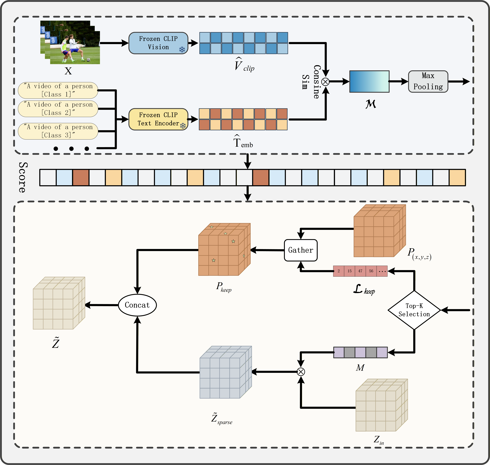
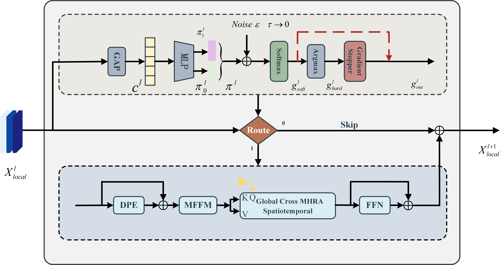
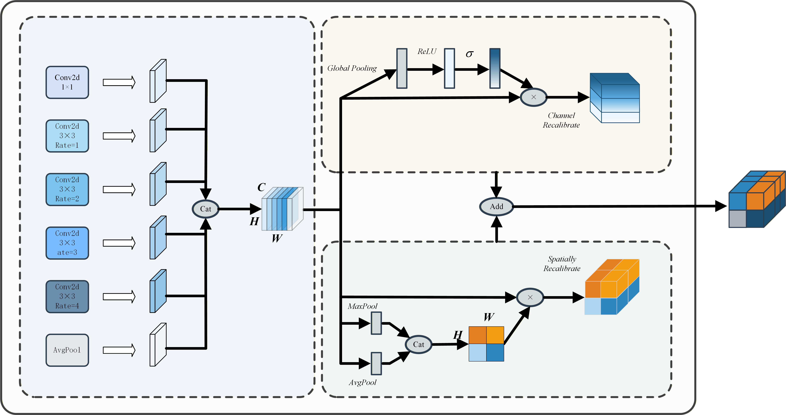

# L-PRF Net: An Efficient Hybrid Architecture for Identifying Unsafe Behaviors in Laboratory Settings

This repository contains the official PyTorch implementation of our paper: **"L-PRF Net: A hybrid architecture for identifying unsafe behaviors in laboratory settings"**.

## 💡 Abstract

Video action recognition in complex controlled environments (e.g., laboratories and chemical plants) generally faces challenges of high spatio-temporal redundancy and difficulties in fine-grained feature extraction. Due to the adoption of dense computing paradigms and static network topologies, existing hybrid video architectures suffer from redundant computational overhead and limited perception capabilities for subtle key actions. 

To address these issues, we propose an efficient hybrid vision architecture, **L-PRF Net**, to optimize the trade-off between recognition accuracy and computational overhead.

## 🚀 Key Components

L-PRF Net is built upon the UniFormerV2 baseline and introduces three collaborative modules:

* **SGTP (Semantics-guided Token Pruning):** Introduced at the shallow feature level, it utilizes a cross-modal vision-language model (CLIP) as prior knowledge to filter out background noise while preserving the 3D spatio-temporal topology. It effectively reduces computational overhead with a token retention ratio of 0.6.
* **ADRA (Adaptive Dynamic Routing Agent):** Designed during the deep interaction stage to achieve conditional computation via a lightweight gating mechanism. It dynamically determines the activation depth of global aggregation blocks based on the semantic complexity of action samples.
* **FFCM (Fine-grained Feature Compensation Module):** Embedded to compensate for local information attenuation caused by sparsification. It utilizes a dense dilated convolution array (with dilation rates r=1, 2, 3, 4) and a parallel dual attention mechanism (channel and spatial) to enhance the feature representation capability for subtle actions.
  ## 🧩 Core Innovations & Architecture

L-PRF Net optimizes the trade-off between recognition accuracy and computational overhead through three physical-level restructurings of the baseline model. 

### 1. Semantics-Guided Token Pruning (SGTP)


*Figure 1: Architecture of the Semantic-Guided Token Pruning (SGTP) module.*

At the shallow feature extraction stage, the **SGTP** module is introduced to filter out redundant background tokens and reduce computational burden. Unlike heuristic pruning based on low-level motion gradients, it leverages a frozen cross-modal vision-language model (CLIP) to extract prior semantic features. By calculating the relevance scores between video tokens and action semantics, it dynamically drops irrelevant background noise while perfectly preserving the 3D spatio-temporal topological structure necessary for downstream convolutions.

### 2. Adaptive Dynamic Routing Agent (ADRA)


*Figure 2: Internal architecture and computational flow of the ADRA module.*

During the deep feature interaction stage, we design the **ADRA** to achieve spatio-temporal conditional computation. Utilizing Gumbel-Softmax and a Straight-Through Estimator (STE) bypass mechanism, this lightweight gating agent dynamically determines the activation depth of the Global UniBlocks based on the semantic complexity of the input sequence. This effectively mitigates the static computational waste caused by excessive inference of simple, periodic action samples in deep networks.

### 3. Fine-grained Feature Compensation Module (FFCM)


*Figure 3: Architecture of the FFCM with dense dilated convolutions and parallel dual attention.*

To compensate for the potential attenuation of local structural details caused by spatial sparsification, the **FFCM** is embedded prior to the global attention blocks. It employs a densely distributed dilated convolution array (with small, continuous dilation rates $r \in \{1, 2, 3, 4\}$) to extract multi-scale contextual features without inducing "Gridding Artifacts". Subsequently, a parallel dual attention mechanism independently evaluates channel semantics and spatial locations, significantly enhancing the network's perceptual focusing capability on small-scale and locally occluded abnormal actions in complex environments.

## 📊 Main Results

L-PRF Net achieves state-of-the-art trade-offs between accuracy and computational cost (GFLOPs).

| Dataset | Backbone | Views | GFLOPs | Params (M) | Top-1 Acc (%) | Top-5 Acc (%) |
| :--- | :---: | :---: | :---: | :---: | :---: | :---: |
| [cite_start]**Kinetics-400** [cite: 212] | ViT-B | 4×3 | 157.3 | 133.5 | **85.6** | **96.9** |
| [cite_start]**Something-Something V2** [cite: 226] | ViT-B | 1×3 | 208.7 | 178.1 | **71.8** | **93.5** |
| [cite_start]**LabUB V1** (Ours) [cite: 239] | ViT-B | 4×3 | 213.3 | 125.7 | **80.3** | **95.2** |

## 🛠️ Installation & Environment

This project is based on the [OpenMMLab](https://openmmlab.com/) ecosystem, specifically `mmaction2`. 

**Requirements:**
* Python >= 3.8
* PyTorch >= 1.10.0
* `mmcv`, `mmaction2`
* `opencv-python`, `matplotlib`, `numpy`

**Installation Steps:**
```bash
conda create -n lprf python=3.8 -y
conda activate lprf
# Install PyTorch
pip install torch torchvision torchaudio
# Install MMCV and MMAction2
pip install -U openmim
mim install mmcv
mim install mmaction2
# Clone this repo
git clone [https://github.com/YourUsername/L-PRF-Net.git](https://github.com/YourUsername/L-PRF-Net.git)
cd L-PRF-Net
pip install -r requirements.txt
